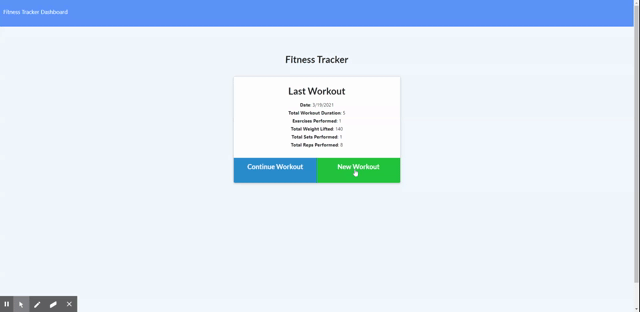

# Fitness Tracker

## Description
This Fitness Tracker was created for the user to be able to keep track of their workouts throughout the week! 
[See the deployed version here](https://rocky-garden-10442.herokuapp.com/?id=605578cca6effb001593ab4c)

***
## Walkthrough

***
## Table of Contents
* [Installation](#installation)
* [Usage](#usage)
* [Contributors](#contributors)
* [Tests](#tests)
* [Questions](#questions)
* [License](#License)

***
## Installation
After downloading this project, please make sure to run an 'npm install' to download all dependencies. From there you can run this locally by using node server.js in the command line.

***
## Usage
This project allows our user to create their workout routine and see their weekly progres and stats of their workouts. It allows the user to be more efficient with their workouts and challenge themselves!

***
## Contributors
Dana Corona

***
## Tests
None

***
## Questions
For questions about this project please reach out to me!

[My Github Account](https://github.com/danacorona)

[My Email](dana.d.corona@gmail.com)

***
## License

***